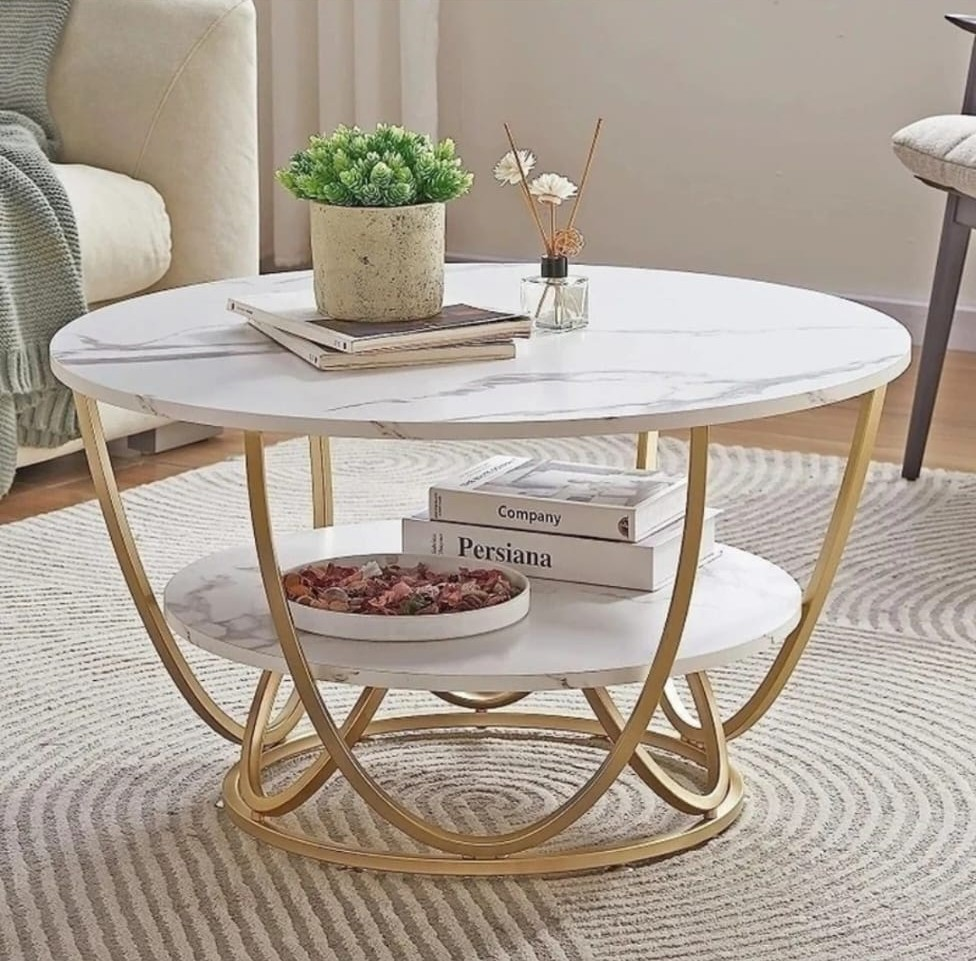
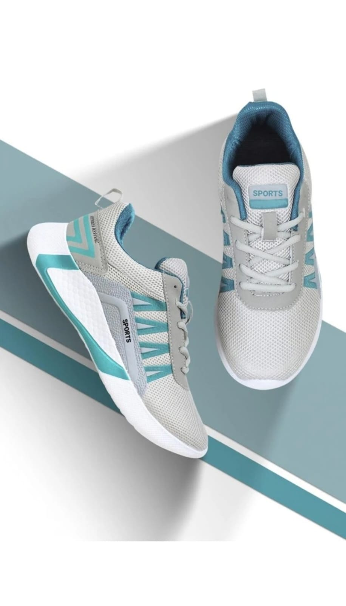
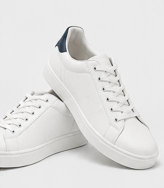
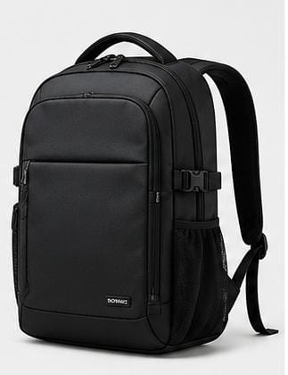
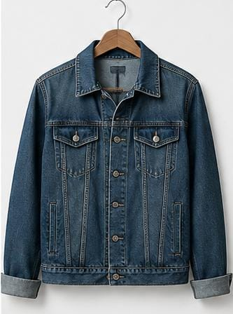

# Total HTML Codes

## `index.html`
```html
<!doctype html>
<html lang="en">
  <head>
    <meta charset="UTF-8" />
    <meta name="viewport" content="width=device-width, initial-scale=1.0" />
    <title>WebKart - Home</title>
    <link rel="stylesheet" href="index.css" />
  </head>

  <body>
    <!-- Main Container -->
    <div class="Home">
      <!-- Hero Section -->
      <div class="hero">
        <h1>Welcome to WebKart</h1>
        <h2>
          Shop Smart,<br /><span style="padding-left: 10px">Live Better</span>
        </h2>
        <p>Discover products you love, at prices you'll love even more.</p>
        <div class="button"><a href="products.html"> Shop Now</a></div>
      </div>

      <!-- Featured Categories -->
      <div class="cat">
        <h2>Featured Categories</h2>
        <div class="cat-cards">
          <a href="categories.html" class="cat-card">
            
            <h4>Electronics</h4>
          </a>
          <a href="categories.html" class="cat-card">
            
            <h4>Fashion</h4>
          </a>
          <a href="categories.html" class="cat-card">
            
            <h4>Beauty</h4>
          </a>
          <a href="categories.html" class="cat-card">
            
            <h4>Home & Living</h4>
          </a>
          <a href="categories.html" class="cat-card">
            
            <h4>Sports</h4>
          </a>
          <a href="categories.html" class="cat-card">
            
            <h4>Toys & Kids</h4>
          </a>
        </div>
      </div>

      <!-- Featured Products -->
      <div class="deals">
        <h2>Featured Products</h2>
        <div class="deals-cards">
          <div class="deals-card">
            
            <div>
              <h4>PS5 Console</h4>
              <p>price: 50,000/-</p>
            </div>
          </div>
          <div class="deals-card">
            
            <div>
              <h4>Travel Backpack</h4>
              <p>price: 5,000/-</p>
            </div>
          </div>
          <div class="deals-card">
            
            <div>
              <h4>White Sneakers</h4>
              <p>price: 3,000/-</p>
            </div>
          </div>
          <div class="deals-card">
            
            <div>
              <h4>Headphones</h4>
              <p>price: 3,200/-</p>
            </div>
          </div>
          <div class="deals-card">
            
            <div>
              <h4>Sun Glasses</h4>
              <p>price: 1,200/-</p>
            </div>
          </div>
          <div class="deals-card">
            
            <div>
              <h4>Smart Watch</h4>
              <p>price: 2,100/-</p>
            </div>
          </div>
        </div>
      </div>
    </div>
  </body>
</html>
```

## `products.html`
```html
<!doctype html>
<html lang="en">

<head>
    <meta charset="UTF-8" />
    <meta name="viewport" content="width=device-width, initial-scale=1.0" />
    <title>Products</title>
    <link rel="stylesheet" href="products.css" />
</head>

<body>

    <main>
        <section class="products-header">
            <h1>
                <bold>Discover Our Products</bold>
            </h1>
            <p>Quality Products. Great Prices. Just for You.</p>
        </section>
        <div class="filters">
            <div class="categories">
                <button class="selected">All</button>
                <button>Electronics</button>
                <button>Fashion</button>
                <button>Beauty</button>
                <button>Home & Living</button>
                <button>Sports</button>
                <button>Toys & Kids</button>
            </div>

            <div class="sort">
                <label>Sort by:</label>
                <select>
                    <option>Popular</option>
                    <option>Price: Low to High</option>
                    <option>Price: High to Low</option>
                </select>
            </div>
        </div>
        <section class="product-grid">
            <div class="product-card">
                
                <h3>Smart Watch Pro</h3>
                <div class="rating">★★★★★ <span>(120)</span></div>
                <p class="price">₹2,699 <del>₹3,299</del></p>
                <button class="cart-btn">Add to Cart</button>
            </div>

            <div class="product-card">
                
                <h3>Classic White Sneakers</h3>
                <div class="rating">★★★★★ <span>(98)</span></div>
                <p class="price">₹1,499 <del>₹1,999</del></p>
                <button class="cart-btn">Add to Cart</button>
            </div>

            <div class="product-card">
                
                <h3>Travel Backpack</h3>
                <div class="rating">★★★★★ <span>(75)</span></div>
                <p class="price">₹1,099 <del>₹1,499</del></p>
                <button class="cart-btn">Add to Cart</button>
            </div>

            <div class="product-card">
                
                <h3>Wireless Headphones</h3>
                <div class="rating">★★★★★ <span>(150)</span></div>
                <p class="price">₹1,699 <del>₹2,199</del></p>
                <button class="cart-btn">Add to Cart</button>
            </div>

            <div class="product-card">
                
                <h3>Sunglasses</h3>
                <div class="rating">★★★★★ <span>(65)</span></div>
                <p class="price">₹899 <del>₹1,199</del></p>
                <button class="cart-btn">Add to Cart</button>
            </div>

            <div class="product-card">
                
                <h3>Denim Jacket</h3>
                <div class="rating">★★★★★ <span>(87)</span></div>
                <p class="price">₹1,999 <del>₹2,499</del></p>
                <button class="cart-btn">Add to Cart</button>
            </div>

            <div class="product-card">
                
                <h3>Perfume for Men</h3>
                <div class="rating">★★★★★ <span>(110)</span></div>
                <p class="price">₹1,349 <del>₹1,799</del></p>
                <button class="cart-btn">Add to Cart</button>
            </div>

            <div class="product-card">
                
                <h3>Smart Speaker</h3>
                <div class="rating">★★★★★ <span>(92)</span></div>
                <p class="price">₹2,199 <del>₹2,799</del></p>
                <button class="cart-btn">Add to Cart</button>
            </div>
        </section>
    </main>

</body>

</html>
```

## `review.html`
```html
<!DOCTYPE html>
<html lang="en">

<head>
    <meta charset="UTF-8">
    <meta name="viewport" content="width=device-width, initial-scale=1.0">
    <title>WebKart - Customer Reviews</title>
    <link rel="stylesheet" href="reviews.css">
</head>

<body>

    <main>
        <section class="reviews">
            <h1>What Our Customers Say!</h1>
            <p class="subtitle">Loved by shoppers. Trusted by Thousands.</p>

            <div class="review-container">
                <div class="review-card">
                    <div class="customer">
                        
                        <div>
                            <h3>Flash Sale</h3>
                            <div class="stars">★★★★★</div>
                        </div>
                    </div>
                    <p>"Amazing shopping experience! The product arrived exactly as shown. Very happy with the quality."
                    </p>
                </div>

                <div class="review-card">
                    <div class="customer">
                        
                        <div>
                            <h3>Alex</h3>
                            <div class="stars">★★★★★</div>
                        </div>
                    </div>
                    <p>"Great quality at a really good price. Definitely shopping here again."</p>
                </div>

                <div class="review-card">
                    <div class="customer">
                        
                        <div>
                            <h3>Ananya R.</h3>
                            <div class="stars">★★★★★</div>
                        </div>
                    </div>
                    <p>"Fast delivery and excellent customer service. Highly recommended!"</p>
                </div>
            </div>

            <button class="review-button">View more Reviews</button>
        </section>
    </main>

</body>

</html>
```

## `contact.html`
```html
<!doctype html>
<html lang="en">

<head>
    <meta charset="UTF-8" />
    <meta name="viewport" content="width=device-width, initial-scale=1.0" />
    <title>Contact</title>
    <link rel="stylesheet" href="contact.css">
</head>

<body>

    <div class="contact-header">
        <h1>We'd Love to Hear From You</h1>
        <p><b>Have a Question? We are here to help.</b></p>
    </div>
    <div class="container">
        <div class="contact">
            <form action="">
                <label for="">Fullname</label>
                <br>
                <input type="text" placeholder="Enter your name" />
                <br>
                <label for="">Email Address</label>
                <br>
                <input type="email" placeholder="Enter your email" />
                <br>
                <label for="">Message</label>
                <br>
                <textarea rows="5" placeholder="Type your message here..."></textarea>
                <br>
                <button type="submit">Send Message</button>
            </form>
        </div>
        <div class="help">
            <span>
                <h4>📩Email</h4>shopora@gmail.com
            </span>
            <span>
                <h4>📞Phone</h4>9876543210
            </span>
            <span>
                <h4>📍Location</h4>Vishakapatnam, India
            </span>
            <span>
                <h4>🕑Working hours</h4>Mon - Sat : 9.00 AM - 9.00 PM<br>Sun : 10.00 AM - 6.00 PM
            </span>
        </div>
    </div>

</body>

</html>
```
